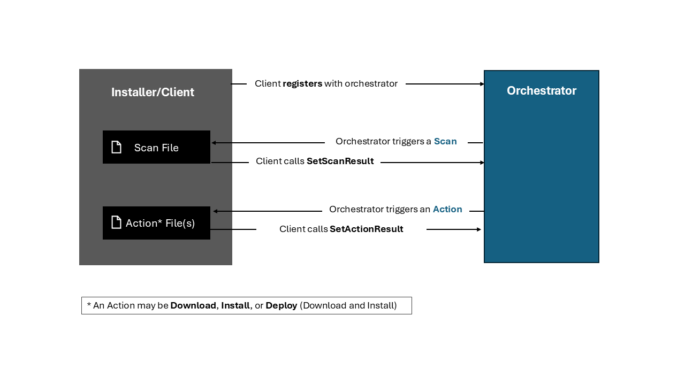

# Windows Update Orchestration Platform - API Usage Guide

*Microsoft Confidential | Commercial In Confidence.*

Welcome to the WinRT API Usage Guide for the Windows Update Orchestration Platform. This guide is designed to help developers and product teams integrate with and utilize the orchestration platform APIs.


## Table of Contents

1. [Introduction](#introduction)
2. [Key Concepts](#key-concepts)
3. [Step-by-Step Usage](#step-by-step-usage)
4. [WinRT API Reference](#winrt-api-reference)
5. [Error Handling](#error-handling)
6. [Support](#support)


## Introduction

Today, the Windows Update Session Orchestrator (USO) is a built-in system component used to schedule and orchestrate Windows Updates (and other updates such as those for Microsoft Store and Defender) so that update work can be invoked and performed during optimal times (e.g., when the user is away, outside of Active Hours) to minimize impact.

The Windows Update Orchestration Platform (UOP) APIs are built to enable third-party software providers to leverage the same intelligent scheduling smarts for their own updates.

These APIs are designed with the following 2 user groups in mind:

1. Product teams/developers building __management tools__ that have their own agent/client on the device to orchestrate app or driver updates outside of those provided by Windows Update
2. Product teams/developers building __applications__ that have their own agent/client on the device to orchestrate app updates

The Windows Update Orchestration Platform enables software providers to leverage intelligent scheduling for updates, minimizing user impact and maximizing efficiency. This guide provides all the information needed to register, scan, and manage updates using the platform APIs.

## Key Concepts

### Supported Update Types

The Windows Update orchestration platform supports the following update types:

1. **MSIX/APPX**: These updates are acquired from MSIX/APPX install URIs (https-only). Their installation type is `AppPackage`.

2. **MSI/Win32/EXE/Powershell**: These updates are downloaded and installed by your own Executable (.exe) or Powershell (.ps1) scripts. Their installation type is `Executable` or `Powershell`. These scripts must call platform APIs to report the result of the download and install.

###  Key Terms

- **Client**: This is your application or client that will call the WinRT APIs.
- **Orchestrator**: The in-box Windows component that schedules and manages update work.
- **Register Update Provider**: An Update Provider ([`WindowsSoftwareUpdateProvider`](#windowssoftwareupdateprovider)) is the entity responsible for managing updates. In order for the orchestrator to have knowledge of your updates and schedule work for them, the Update Provider must first be registered with the orchestrator via the Register API. See [Step-By-Step Usage](#step-by-step-usage) for more details on how to complete this step.
- **Scan**: This is the first step of the update lifecycle. During scan, the orchestrator collects a list of updates that are applicable to the device. The orchestrator schedules a scan to happen every 22 hours. At scan time, the orchestrator executes your Scan File.
    - **Scan File**: The executable/script called by the orchestrator to get a collection of applicable updates. An Update Provider must be instantiated with the file path to the Scan File.
    - **SetScanResult**: This API call must be included in the Scan File in order to inform the orchestrator of which updates require work. This API call takes in as input a collection of [`WindowsSoftwareUpdate`](#windowssoftwareupdate)s to be installed on the device. Only updates that are applicable to the device should be included in the scan result collection. Updates that are no longer available to be installed (either because they are already installed or they are no longer applicable) should not be included in the Scan Result collection.
- **Action**: The orchestrator will schedule update actions (downloads and installs) to happen at an optimal time with respect to user activity, management policies, and installation deadline (if applicable). An action may refer to: (a) Download; (b) Install; or (c) Deploy (Download and Install as one combined action). See [`WindowsSoftwareUpdateExecutionInfo`](#windowssoftwareupdateexecutioninfo) for more details.
    - **Action File**: The executable/script called by the orchestrator to perform the update action.
    - **SetActionResult**: This API call must be included in the Action File to indicate the result of the action.
    - **SetActionProgress**: This optional API call can be periodically made throughout the execution of the update action to indicate progress (as a percentage) that will be displayed to the end user via the Settings > Apps > Installed Apps page.



## Step-by-Step Usage

### 1. Prepare your Registration JSON File

The Registration JSON file is needed to provide crucial information about your update provider to the orchestrator. The registration file must be placed in a designated folder along with all the executable files and scripts referenced in the JSON.

```json
{
    "Id": "SampleProvider",
    "Version": "1.0.0.0",
    "Type": "Powershell",
    "CatalogFile": "catalog.cat",
    "ScanFileName": "SampleProvider-scan.ps1",
    "ScanFileArguments": "-ProviderId SampleProvider -LogFile SampleProvider.log -Verbose",
    "PayloadFiles": [
        {
            "FileName": "SampleProvider-action.ps1",
            "FileHash": "IK4D0xHLsYYDMPMC4nZ7YPcnNtaw/VilrqfT/aF4ur0="
        },
        {
            "FileName": "SampleProvider-scan.ps1",
            "FileHash": "E11+Yw7wdmn0Wr1Ysc0Bjnhmls1H17lObPtTQuMHHsI="
        },
        {
            "FileName": "UOP-runtime.psd1",
            "FileHash": "keYt2YYfvpwF1AIqTJ6jzxLOkb2Bda5lnjJ7O9THAPc="
        },
        {
            "FileName": "UOP-runtime.psm1",
            "FileHash": "p2NnwYYfvpwF1AIqTJ6jzxLOa9kBda5lnjJ7O9THAPc="
        }
    ]
}
```

**Required Fields:**
- **Id**: Unique provider identifier name.
- **Version**: Provider version in semantic versioning format.
- **Type**: The installation method for your updates. Allowed values: `Executable` and `Powershell`.
- **CatalogFile**: Path to your catalog file that contains file hashes for security validation.
- **ScanFileName**: Path to your scan executable or Powershell script that performs the scan operation.
- **PayloadFiles**: A collection of objects containing (`FileName`, `FileHash`) pairs for each executable or Powershell script needed to run your download, install, and deploy processes.

**Optional Fields:**
- **ScanFileArguments**: Arguments to pass to the scan file when executed.
- **ScanFrequencyInHours**: Specifies how often the orchestrator should execute the provider's scan script to check for new updates. Must be between 12 and 360 hours (15 days). If not specified, the orchestrator uses the default frequency of 22 hours.
- **MigrateStateOnUpgrade**: Specifies whether provider state data (logs, configuration files, etc. stored in the State folder) should be preserved when the OS is upgraded.

When you first begin development, you will not yet have the file names and file hashes ready for `PayloadFiles`. After completing the next step, we will return to this registration JSON file and amend it with this required field.

### 2. Prepare all necessary files - Scan (required), Action (optional), App close or restart (optional)

#### 2A. Scan File (required)

You'll notice that two of the required fields in the registration JSON file are `ScanFileName` and `ScanFileArguments`. These fields refer to the file path of the script that contains your scan logic and the arguments for which the script should be run with. Below is an example of a scan script that creates a collection of `WindowsSoftwareUpdate`s and calls the `SetScanResult` API.

A `WindowsSoftwareUpdate` represents an update and specifies all the information needed by the orchestrator to download and install it, including information like installation deadline and grace period (only applies to management scenarios - see Step 0 above).

The following example illustrates the 2 types of apps/updates that can be constructed:

- The first `WindowsSoftwareUpdate` in this example is an MSIX app update (AppBundle) so we construct it by specifying the `appPackageProperties` along with the required properties.

- The second `WindowsSoftwareUpdate` in this example is an update with custom scripts so we construct it by specifying the `executionInfo` along with the required properties. More details can be found in Steps 2B and 2C.

```powershell
# This is a placeholder for the actual scan logic.
# The scan returns a list of updates that are applicable to the system.
# You would then construct the WindowsSoftwareUpdateScanResult object with the updates found.

# In this example, two different updates are being constructed – appPackage,
# customScript updates.


# 1.) Create App Package Update
# First create the AppPackageProperties
$appPackageProperties = [Windows.Management.Update.WindowsSoftwareUpdateAppPackageInfo]::new(
    "Contoso.AppPackage1_8h66172c634n0", # Package Family Name
    [Windows.Management.Update.WindowsSoftwareUpdateArchitecture]::X64, # Architecture
    [System.Uri]::new("https://www.contoso.com/appbundle")
)

$update1 = [Windows.Management.Update.WindowsSoftwareUpdate]::new(
    "Contoso",
    [Windows.Management.Update.WindowsSoftwareUpdateInstallationType]::AppPackage,
    "ContosoAppPackageUpdate",
    "Contoso AppPackage Update - V3.2.0.0",
    "Contoso AppPackage Update Version 3.2.0.0",
    [System.Uri]::new("https://www.contoso.com/appPackage"),
    [int](1024 * 1024 * 200), # 200 MB download size
    [int](1024 * 1024 * 300),  # 300 MB install size
    [Windows.Management.Update.WindowsSoftwareUpdateVersion]::new(2, 0, 0, 0), # Source Version
    [Windows.Management.Update.WindowsSoftwareUpdateVersion]::new(3, 2, 0, 0), # Target Version
    $appPackageProperties,
    $null, # No ExecutionInfo
    $null
)


# 2.) Create Custom Exe Update with optional actions
$downloadActionInfo = [Windows.Management.Update.WindowsSoftwareUpdateActionInfo]::new(
    "updateinstaller.exe", # Custom Executable
    "/download", # Arguments
    [Windows.Management.Update.WindowsSoftwareUpdateActionType]::Download
)

$installActionInfo = [Windows.Management.Update.WindowsSoftwareUpdateActionInfo]::new(
    "updateinstaller.exe", # Custom Executable
    "/install", # Arguments
    [Windows.Management.Update.WindowsSoftwareUpdateActionType]::Install
)

# Create execution info
$executionInfo = [Windows.Management.Update.WindowsSoftwareUpdateExecutionInfo]::new(
    $downloadActionInfo, # Download
    $installActionInfo,  # Install
    $null                # No optional actions
)

# Create the WindowsSoftwareUpdate object
$update2 = [Windows.Management.Update.WindowsSoftwareUpdate]::new(
    "Contoso",
    [Windows.Management.Update.WindowsSoftwareUpdateInstallationType]::Executable,
    "ExeUpdate",
    "Contoso Client Installer - V2.5.0.0",
    "Contoso Client Installer Version 2.5.0.0",
    [System.Uri]::new("https://www.contoso.com/exeupdate"),
    [int]1024 * 1024 * 10, # 10 MB download size
    [int]1024 * 1024 * 20,  # 20 MB install size
    [Windows.Management.Update.WindowsSoftwareUpdateVersion]::new(1, 0, 0, 0), # Source Version
    [Windows.Management.Update.WindowsSoftwareUpdateVersion]::new(2, 5, 0, 0), # Target Version
    $null,              # AppPackage info
    $executionInfo,
    $null               # No OptionalInfo
)

# Create a list and add the updates
$updateCollection = [System.Collections.Generic.List[Windows.Management.Update.WindowsSoftwareUpdate]]::new()
$updateCollection.Add($update1)
$updateCollection.Add($update2)

# Create provider status
$providerStatus = [Windows.Management.Update.WindowsSoftwareUpdateProviderStatus]::new("Contoso")

# SetScanResult
$hresult_S_OK = [int]0x00000000
$extendedError = [uint64]0
$statusResult = $providerStatus.SetScanResult($true, $hresult_S_OK, $extendedError, $updateCollection)

if ($statusResult) {
    Write-Host "SetScanResult(): $statusResult"
}
else {
    Write-Warning "SetScanResult() -> Warning: Returned null result"
}
```

#### 2B. Download and install scripts (optional)

If your updates are of type `Executable` or `Powershell`, you will need to provide the file paths to the download and install files or to the deploy file and their corresponding arguments via the [WindowsSoftwareUpdateActionInfo](#windowssoftwareupdateactioninfo) that is specified in a [WindowsSoftwareUpdate](#windowssoftwareupdate) when SetScanResult was called.

Your download, install, or deploy files MUST set a provider action result of type [WindowsSoftwareUpdateProviderActionResult](#windowssoftwareupdateprovideractionresult) using the [`SetActionResult`](#windowssoftwareupdateproviderstatus) method.

**A note on updates that require a device reboot or app close/restart:** If your update requires a device reboot, you may utilize [WindowsSoftwareUpdateProviderActionResult](#windowssoftwareupdateprovideractionresult) to set a [WindowsSoftwareUpdateRestartReason](#windowssoftwareupdaterestartreason). The supported restart reasons are:

1. __System:__ This is a device reboot. This restart reason should be set in your Deploy or Install file if the update needs to reboot the device to complete installation. Unless the update has an installation deadline and grace period specified (see note below), the orchestrator will wait until the next scheduled reboot time to reboot the device.
2. __App Close:__ This closes the app. This restart reason should be set in your Deploy or Install file if the update needs to close the app to complete installation. The orchestrator will call your provided `CloseAndDeploy` (if your update supports the Deploy action) or `CloseAndInstall` (if your update supports separate download and install actions) file. This file, when executed, should close all running processes that are blocking the update from completing Install. It is specified as part of the construction of your `WindowsSoftwareUpdate` (use [`WindowsSoftwareUpdateOptionalActionInfo`](#windowssoftwareupdateoptionalactioninfo)). If the update has no such provided files, setting the AppClose restart reason has the same effect as System.
3. __App Restart:__ This restarts the app. This restart reason should be set in your Deploy or Install file if the update needs to restart the app to complete installation. The orchestrator will call the provided `CloseAndRestart` file. This file, when executed, should close the processes that are blocking the update from installing and restarting them. This file is specified as part of the construction of your `WindowsSoftwareUpdate` (use [`WindowsSoftwareUpdateOptionalActionInfo`](#windowssoftwareupdateoptionalactioninfo)). If the update has no such file, setting the AppRestart restart reason has the same effect as System.

These restart reasons are resolved when the corresponding action (System reboot, App Close, or App restart) is completed - either automatically when scheduled by the orchestrator (e.g., orchestrator calls the Close and deploy install file, which closes the app's running processes) or with intervention by the end user (e.g., end user closes the app).

**A note on updates that have an installation deadline:** By default, the Windows Update orchestration platform does *not* support installation deadline and grace period (See [`WindowsSoftwareUpdateOptionalInfo`](#windowssoftwareupdateoptionalinfo)). However, if you are planning to use the Windows Update orchestration platform to support IT admin management scenarios (i.e., as an MDM), configure the following CSP or MDM Policy: Update/SetAllowedDeadlineProviders on devices. This policy specifies a list of Provider IDs for which deadline and grace period should be honored. Any providers whose ID is not listed here will be installed without a deadline.

The Windows Update orchestration platform uses the following definitions:
- Deadline (in days): Number of days before updates are installed on devices automatically. After the deadline passes, restarts will occur regardless of active hours and users won't be able to reschedule.
- Grace period (in days): Minimum number of days from update installation until restarts occur automatically (if the update requires an app or device restart). This only takes effect when a deadline is also set.

IT admins should be aware that setting a deadline for updates that have a System restart reason will cause the device to take a reboot it may not have otherwise taken.

The following example illustrates how to call the APIs to set action results and progress. Note: the example is pseudocode and should not be treated as code that can compile.

```powershell
# Perform necessary operations required as part of a download action
# Ex: Downloading the required installer corresponding to the app update
# to the sandbox location

$providerStatus = [Windows.Management.Update.WindowsSoftwareUpdateProviderStatus]::new("Contoso")

# While the update action is in progress, report progress updates.
# In this sample we are just sleeping and sending incremental progress.
# Real implementation should query for download/install progress values.
for($i = 01; $i -le 100; $i += 1) {
    try {
        # Simulate download action
        $providerStatus.SetActionResult($true, $i, 100)
        Write-Host "SetActionProgress(): $i $true"
    }
    catch {
        Write-Warning "SetActionResult() -> Failed: $($_.Exception.Message)"
        break
    }
    Start-Sleep -Milliseconds 100
}

# At the end of the action, report the final result
$actionResult = [Windows.Management.Update.WindowsSoftwareUpdateProviderActionResult]::new(
    [Windows.Management.Update.WindowsSoftwareUpdateActionResult]::Succeeded,
    [Windows.Management.Update.WindowsSoftwareUpdateRestartReason]::None,
    0,  # Success result code
    0   # No extended error code
)

try {
    $statusResult = $providerStatus.SetActionResult($actionResult)
    Write-Host "SetActionResult(): $statusResult"
}
catch {
    Write-Warning "SetActionResult() -> Failed: $($_.Exception.Message)"
}
```

### 3. Validate Your Registration JSON File and Register Your Update Provider

Running validation of your Registration JSON file is crucial to make sure that your JSON file meets all of the platform requirements for registration. Validation checks for:
- All required fields are specified
- Catalog, scan, and payload file paths are valid
- Update provider type is valid

If validation fails, an extended error code with the specific validation failure will be returned. See [Error Codes](#error-codes).

Once your Registration JSON file passes validation, you are ready to register your update provider with the orchestrator via the `Register()` API!

> **Note:** While calling `Validate()` before `Register()` is recommended as a best practice, it is not strictly required. The `Register()` API automatically performs validation as part of the registration process. However, running `Validate()` separately first allows you to identify and fix any configuration issues before attempting registration, making debugging easier.

```powershell
$providerPath = "C:\ProgramData\Providers\Registered\Contoso"

try {
    $provider = New-Object Windows.Management.Update.WindowsSoftwareUpdateProvider($providerPath)

    $validateResult = $provider.Validate()

    if($validateResult.Succeeded -eq $true) {
        Write-Host "Validation succeeded!"
        $registrationResult = $provider.Register()
        if ($registrationResult.Succeeded -eq $true) {
            Write-Host "Registration succeeded!"
        }
        else {
            Write-Warning "Register() -> Failed: $($registrationResult.ResultCode)"
        }
    }
    else {
        Write-Warning "Validate() -> Failed: $($validateResult.ResultCode)"
        return $validateResult
    }
}
catch {
    Write-Warning "Exception: $_"
}
```

### 4. Scan for Updates

Once your update provider has been registered and your Scan Script has been implemented, the orchestrator will trigger your scan script to run at the default 22 hour frequency.

For development and testing purposes you may want to trigger an interactive scan without causing the orchestrator to schedule further update actions like download and install so that you can verify that the scan result is what you expect by setting the `WindowsUpdateManagerScanOptions.PerformUpdateActions` property to `false` or you can trigger a scan via Powershell cmdlet.

The following example illustrates how to call the APIs to scan for updates and check the Scan Result. Note: the example is pseudocode and should not be treated as code that can compile.

```powershell
$manager = New-Object Windows.Management.Update.WindowsUpdateManager("ContosoClient")

$scanOptions = [Windows.Management.Update.WindowsUpdateManagerScanOptions]::new()
$scanOptions.IsUserInitiated = $true
$scanOptions.PerformUpdateActions = $false
$scanOptions.AllowBypassThrottling = $true

$scanResult = $manager.StartScan($scanOptions)

if ($scanResult.Succeeded -eq $true) {
    Write-Host "Scan succeeded!: $scanResult"
    return $scanResult.Updates
}
else {
    Write-Warning "Scan failed: $($scanResult.ResultCode)"
}
```

### 5. Download and Install Your Update

Once the `ScanResult` has been set, the orchestrator will schedule download and install work to be performed on each update. To verify that download and install work is happening, navigate to the Settings > Apps > Installed Apps page. You should see your update(s) listed as pending and that the update is downloading and/or installing.

### 6. Unregister Your Provider

During the development lifecycle, you may need to update your provider's files, modify the registration JSON, or make changes to your scan and action scripts. To apply these updates, you'll need to unregister your provider first using the `Unregister()` API, make your changes, and then register again with the updated configuration.

```powershell
try {
    $manager = New-Object Windows.Management.Update.WindowsUpdateManager("ContosoClient")

    $provider = $manager.GetProvider("Contoso")
    $result = $provider.Unregister()

    if ($result.Succeeded -eq $false) {
        Write-Error "Provider unregistration failed: $($result.ResultCode)"
    }
    else
    {
        Write-Host "Provider unregistered successfully!" -ForegroundColor Green
    }
    return $result
}
catch {
    Write-Error "Failed to unregister provider: $_"
    throw
}
```

## WinRT API reference

This section documents all WinRT interfaces, classes, enums, and structs available in the Windows Update Orchestration Platform API, based on the IDL contract. It is broken up into subsections:

1. [Core Classes](#core-classes)
2. [Result Classes](#result-classes)
3. [Enumerations](#enumerations)
4. [Supporting Classes](#supporting-classes)

## Core Classes

### WindowsSoftwareUpdateProvider

- **Contract Version:** 2.0
- **Namespace:** `Windows.Management.Update`
- **Description:** Represents a software update provider for registering and managing your update provider with the orchestrator.

**Constructor:**
```csharp
public WindowsSoftwareUpdateProvider(string folderPath)
```

**Properties:**
- `string Id { get; }` - Unique identifier for the provider.
- `string Version { get; }` - Version of the provider.
- `string FolderPath { get; }` - Path to the provider's registration folder.
- `string CatalogFile { get; }` - Path to the catalog file for signature verification.
- `string ScanFileName { get; }` - Path to the scan executable file.
- `string ScanFileArguments { get; }` - Arguments to pass to the scan executable.
- `Windows.Foundation.Collections.IVectorView<WindowsSoftwareUpdateProviderPayloadFileInfo> PayloadFiles { get; }` - Collection of payload file information.
- `WindowsSoftwareUpdateProviderTrustState TrustState { get; }` - Trust state of the provider. See  [`WindowsSoftwareUpdateProviderTrustState`](#WindowsSoftwareUpdateProviderTrustState).
- `WindowsSoftwareUpdateProviderType Type { get; }` - Type of the provider. See  [`WindowsSoftwareUpdateProviderType`](#WindowsSoftwareUpdateProviderType).
- `WindowsSoftwareUpdateProviderRegistrationType RegistrationType { get; }` - Registration type of the provider. See  [`WindowsSoftwareUpdateProviderRegistrationType`](#WindowsSoftwareUpdateProviderRegistrationType).
- `Windows.Foundation.Collections.PropertySet Properties { get; }` - Additional properties of the provider.

**Methods:**
```csharp
public WindowsSoftwareUpdateResult Register()
```
- Registers the provider with the Windows Update Session Orchestrator. The provider must pass validation before registration can succeed.

```csharp
public WindowsSoftwareUpdateResult Unregister()
```
- Removes the provider from the orchestrator's registry. Any pending updates from this provider will be cancelled.

```csharp
public WindowsSoftwareUpdateResult Validate()
```
- Validates the provider's registration folder and metadata before registration. Checks for required files, proper JSON format, and executable accessibility.

```csharp
public object GetPropertyValue(string name)
```
- Retrieves the value of a specific property by name from the provider's property set.

### WindowsSoftwareUpdate

- **Contract Version:** 2.0
- **Namespace:** `Windows.Management.Update`
- **Description:** Represents an individual software update with all metadata required for orchestration.

**Constructors:**
```csharp
public WindowsSoftwareUpdate(
    string providerId,
    WindowsSoftwareUpdateInstallationType installationType,
    string updateId,
    string title,
    string description,
    Windows.Foundation.Uri moreInfoUrl,
    ulong downloadSizeInBytes,
    ulong installSizeInBytes,
    WindowsSoftwareUpdateVersion sourceVersion,
    WindowsSoftwareUpdateVersion targetVersion,
    WindowsSoftwareUpdateAppPackageInfo appPackageInfo,
    WindowsSoftwareUpdateExecutionInfo executionInfo,
    WindowsSoftwareUpdateOptionalInfo optionalInfo
)
```

```csharp
public WindowsSoftwareUpdate(
    string providerId,
    WindowsSoftwareUpdateInstallationType installationType,
    string updateId,
    string title,
    string description,
    Windows.Foundation.Uri moreInfoUrl,
    ulong downloadSizeInBytes,
    ulong installSizeInBytes,
    Windows.Foundation.IReference<Guid> productCode,
    string packageFamilyName,
    WindowsSoftwareUpdateVersion sourceVersion,
    WindowsSoftwareUpdateVersion targetVersion,
    WindowsSoftwareUpdateAppPackageInfo appPackageInfo,
    WindowsSoftwareUpdateExecutionInfo executionInfo,
    WindowsSoftwareUpdateOptionalInfo optionalInfo
)
```

**Properties:**
- `WindowsSoftwareUpdateInstallationType InstallationType { get; }` - Type of installation for this update. See  [`WindowsSoftwareUpdateInstallationType`](#windowssoftwareupdateinstallationtype).
- `string ProviderId { get; }` - Identifier of the provider that owns this update.
- `string UpdateId { get; }` - Unique identifier for the update.
- `string Title { get; }` - Display title of the update.
- `string Description { get; }` - Detailed description of the update.
- `Windows.Foundation.Uri MoreInfoUrl { get; }` - URL for additional information about the update.
- `ulong DownloadSizeInBytes { get; }` - Size of the download in bytes.
- `ulong InstallSizeInBytes { get; }` - Size of the installation in bytes.
- `WindowsSoftwareUpdateVersion SourceVersion { get; }` - Current version being updated from. See  [`WindowsSoftwareUpdateVersion`](#windowssoftwareupdateversion).
- `WindowsSoftwareUpdateVersion TargetVersion { get; }` - Target version to update to. See  [`WindowsSoftwareUpdateVersion`](#windowssoftwareupdateversion).
- `Windows.Foundation.IReference<Guid> ProductCode { get; }` - Optional product code for the update.
- `string PackageFamilyName { get; }` - Package family name for app package updates.
- `string CurrentAction { get; }` - Current action being performed on the update.
- `WindowsSoftwareUpdateActionResultInfo ActionResultInfo { get; }` - Result information of the last action performed. See [`WindowsSoftwareUpdateActionResultInfo`](#WindowsSoftwareUpdateActionResultInfo).
- `WindowsSoftwareUpdateApprovalInfo ApprovalInfo { get; }` - Approval information for the update. See [`WindowsSoftwareUpdateApprovalInfo`](#windowssoftwareupdateapprovalinfo).
- `Windows.Foundation.Collections.IVectorView<WindowsSoftwareUpdateActionType> ApprovedActions { get; }` - List of approved actions for the update. See [`WindowsSoftwareUpdateActionType`](#WindowsSoftwareUpdateActionType).
- `WindowsUpdateAttentionRequiredInfo AttentionRequiredInfo { get; }` - Information about why the update requires attention. See [`WindowsUpdateAttentionRequiredInfo`](#WindowsUpdateAttentionRequiredInfo).
- `WindowsSoftwareUpdateActionProgress ActionProgress { get; }` - Progress information for the current action. See [`WindowsSoftwareUpdateActionProgress`](#WindowsSoftwareUpdateActionProgress).
- `Windows.Foundation.IReference<WindowsSoftwareUpdateRestartReason> RestartReason { get; }` - Reason for restart if required. See [`WindowsSoftwareUpdateRestartReason`](#WindowsSoftwareUpdateRestartReason).
- `WindowsSoftwareUpdateAppPackageInfo AppPackageInfo { get; }` - Properties specific to app package updates. See [`WindowsSoftwareUpdateAppPackageInfo`](#WindowsSoftwareUpdateAppPackageInfo).
- `WindowsSoftwareUpdateExecutionInfo ExecutionInfo { get; }` - Execution information for the update. See [`WindowsSoftwareUpdateExecutionInfo`](#WindowsSoftwareUpdateExecutionInfo).
- `WindowsSoftwareUpdateOptionalInfo OptionalInfo { get; }` - Optional properties for the update. See [`WindowsSoftwareUpdateOptionalInfo`](#WindowsSoftwareUpdateOptionalInfo).

**Methods:**
```csharp
public WindowsSoftwareUpdateResult Approve(WindowsSoftwareUpdateApprovalInfo approvalInfo)
```
- Approves the update with the specified approval information, allowing it to proceed with its configured actions.

```csharp
public WindowsSoftwareUpdateResult ApproveCurrentAction(bool approve)
```
- Approves or rejects the current action for the update.

### WindowsUpdateManager

- **Contract Version:** 1.0 (with additions in 2.0)
- **Namespace:** `Windows.Management.Update`
- **Description:** Manages update operations and provides access to update providers and updates.

**Constructors:**
```csharp
public WindowsUpdateManager(string clientId)
```

```csharp
public WindowsUpdateManager(string clientId, string[] providerIdFilter)
```

**Properties:**
- `bool IsScanning { get; }` - Whether a scan operation is currently in progress.
- `bool IsWorking { get; }` - Whether any update work is currently being performed.
- `Windows.Foundation.IReference<Windows.Foundation.DateTime> LastSuccessfulScanTimestamp { get; }` - Timestamp of the last successful scan.
- `string[] ProviderIds { get; }` - Array of provider IDs being managed.

**Methods:**
```csharp
public Windows.Foundation.Collections.IVectorView<WindowsUpdate> GetApplicableUpdates()
```
- Returns a collection of updates that are applicable to the current device.

```csharp
public Windows.Foundation.Collections.IVectorView<WindowsUpdateItem> GetMostRecentCompletedUpdates(int count)
```
- Gets the most recent completed updates up to the specified count.

```csharp
public Windows.Foundation.IAsyncOperation<Windows.Foundation.Collections.IVectorView<WindowsUpdateItem>> GetMostRecentCompletedUpdatesAsync(int count)
```
- Asynchronously gets the most recent completed updates up to the specified count.

```csharp
public void StartScan(bool userInitiated)
```
- Initiates a scan for updates, with option to specify if user-initiated.

```csharp
public WindowsSoftwareUpdateProvider GetProvider(string id)
```
- Retrieves a specific provider by its identifier.

```csharp
public Windows.Foundation.Collections.IVectorView<WindowsSoftwareUpdate> GetApplicableSoftwareUpdates()
```
- Returns a collection of software updates that are applicable to the current device.

```csharp
public WindowsSoftwareUpdateScanResult PerformScan(WindowsUpdateManagerScanOptions options)
```
- Performs a synchronous scan operation with the specified options.

**Events:**
- `ScanningStateChanged` - Fired when scanning state changes.
- `WorkingStateChanged` - Fired when working state changes.
- `ProgressChanged` - Fired when update progress changes.
- `AttentionRequiredReasonChanged` - Fired when attention required reason changes.
- `ActionCompleted` - Fired when an update action completes.
- `ScanCompleted` - Fired when a scan operation completes.

### WindowsSoftwareUpdateProviderStatus

- **Contract Version:** 2.0
- **Namespace:** `Windows.Management.Update`
- **Description:** Status reporting mechanism for software update providers. Use this class to return results at the completion of scan actions, download actions, and/or install actions.

**Constructor:**
```csharp
public WindowsSoftwareUpdateProviderStatus(string providerId)
```

**Events:**
- `CancelRequested` - Fired when cancellation is requested.

**Methods:**
```csharp
public WindowsSoftwareUpdateResult SetScanResult(bool succeeded, uint resultCode, ulong extendedError, Windows.Foundation.Collections.IIterable<WindowsSoftwareUpdate> updates)
```
- Reports the result of a scan operation back to the orchestrator.

```csharp
public WindowsSoftwareUpdateResult SetActionProgress(ulong current, ulong total)
```
- Reports progress for a specific update action.

```csharp
public WindowsSoftwareUpdateResult SetActionResult(WindowsSoftwareUpdateProviderActionResult actionResult)
```
- Reports the final result of an update action.

### WindowsUpdateManagerScanOptions

Configuration options for scan operations.

**Constructors:**
```csharp
public WindowsUpdateManagerScanOptions()
```

```csharp
public WindowsUpdateManagerScanOptions(bool isUserInitiated)
```

**Properties:**
- `bool IsUserInitiated { get; set; }` - Whether the scan was initiated by user action.
- `bool AllowBypassThrottling { get; set; }` - Whether to bypass normal scan throttling.
- `bool PerformUpdateActions { get; set; }` - Whether to perform update actions after scanning (default: true).

## Result Classes

### WindowsSoftwareUpdateResult

Contains the result of software update operations.

**Constructors:**
```csharp
public WindowsSoftwareUpdateResult(bool succeeded, uint resultCode)
```

```csharp
public WindowsSoftwareUpdateResult(bool succeeded, uint resultCode, ulong extendedError)
```

```csharp
public WindowsSoftwareUpdateResult(bool succeeded, bool cancelRequested, uint resultCode, ulong extendedError)
```

**Properties:**
- `bool Succeeded { get; }` - Whether the operation succeeded.
- `bool CancelRequested { get; }` - Whether cancellation was requested.
- `uint ResultCode { get; }` - Result code of operation.
- `ulong ExtendedError { get; }` - Extended error information if operation failed.

### WindowsSoftwareUpdateScanResult

- **Contract Version:** 2.0
- **Namespace:** `Windows.Management.Update`
- **Description:** Contains the result of a scan for software updates.

**Constructors:**
```csharp
public WindowsSoftwareUpdateScanResult(bool succeeded, uint resultCode, Windows.Foundation.Collections.IIterable<WindowsSoftwareUpdate> updates)
```

```csharp
public WindowsSoftwareUpdateScanResult(bool succeeded, uint resultCode, ulong extendedError, Windows.Foundation.Collections.IIterable<WindowsSoftwareUpdate> updates)
```

**Properties:**
- `bool Succeeded { get; }` - Whether the scan operation succeeded.
- `uint ResultCode { get; }` - Result code of the scan.
- `ulong ExtendedError { get; }` - Extended error information if scan failed.
- `Windows.Foundation.Collections.IVectorView<WindowsSoftwareUpdate> Updates { get; }` - Collection of updates found during the scan.

### WindowsSoftwareUpdateProviderActionResult

- **Contract Version:** 2.0
- **Namespace:** `Windows.Management.Update`
- **Description:** Contains the result of a provider action for a software update.

**Constructor:**
```csharp
public WindowsSoftwareUpdateProviderActionResult(WindowsSoftwareUpdateActionResult actionResult, WindowsSoftwareUpdateRestartReason restartReason, uint resultCode, ulong extendedError)
```

**Properties:**
- `WindowsSoftwareUpdateActionResult Result { get; }` - Result of the action.
- `WindowsSoftwareUpdateRestartReason RestartReason { get; }` - Reason for restart if required.
- `uint ResultCode { get; }` - Result code of the action.
- `ulong ExtendedError { get; }` - Extended error information if action failed.

### WindowsSoftwareUpdateActionResultInfo

- **Contract Version:** 2.0
- **Namespace:** `Windows.Management.Update`
- **Description:** Result information for a software update action.

**Properties:**
- `Windows.Foundation.DateTime Timestamp { get; }` - Timestamp when the action completed.
- `bool Succeeded { get; }` - Whether the action succeeded.
- `uint ResultCode { get; }` - Result code of the action.
- `ulong ExtendedError { get; }` - Extended error information if action failed.
- `string Action { get; }` - The action that was performed.

## Enumerations

### WindowsSoftwareUpdateInstallationType

- **Contract Version:** 2.0
- **Namespace:** `Windows.Management.Update`
- **Description:** Defines the supported package types for updates.

```csharp
public enum WindowsSoftwareUpdateInstallationType
{
    WindowsUpdate,
    AppPackage,
    Executable,
    Powershell
}
```

### WindowsSoftwareUpdateActionType

- **Contract Version:** 2.0
- **Namespace:** `Windows.Management.Update`
- **Description:** Defines the actions that can be performed on updates.

```csharp
public enum WindowsSoftwareUpdateActionType
{
    Download,
    Install,
    Deploy,
    Reboot,
    AppRestart
}
```

### WindowsSoftwareUpdateRestartReason

- **Contract Version:** 2.0
- **Namespace:** `Windows.Management.Update`
- **Description:** Defines restart reasons for updates.

```csharp
public enum WindowsSoftwareUpdateRestartReason
{
    None,
    System,
    AppClose,
    AppRestart
}
```

### WindowsSoftwareUpdateArchitecture

- **Contract Version:** 2.0
- **Namespace:** `Windows.Management.Update`
- **Description:** Defines the supported architectures for software updates.

```csharp
public enum WindowsSoftwareUpdateArchitecture
{
    Neutral,
    X86,
    X64,
    Arm,    // Note: Not supported in current generation
    Arm64
}
```

### WindowsSoftwareUpdateActionResult

- **Contract Version:** 2.0
- **Namespace:** `Windows.Management.Update`
- **Description:** Defines the result status of update actions.

```csharp
public enum WindowsSoftwareUpdateActionResult
{
    Succeeded,
    Continue,
    Failed,
    Canceled,
    Removed
}
```

### WindowsSoftwareUpdateProviderTrustState

- **Contract Version:** 2.0
- **Namespace:** `Windows.Management.Update`
- **Description:** Defines trust states for update providers.

```csharp
public enum WindowsSoftwareUpdateProviderTrustState
{
    SignedTrusted,
    SignedUntrusted,
    Unsigned
}
```

### WindowsSoftwareUpdateProviderRegistrationType

- **Contract Version:** 2.0
- **Namespace:** `Windows.Management.Update`
- **Description:** Defines provider registration states.

```csharp
public enum WindowsSoftwareUpdateProviderRegistrationType
{
    None,
    System,
    Windows,
    Pending,
    Registered,
    Unregistered
}
```

### WindowsSoftwareUpdateProviderType

- **Contract Version:** 2.0
- **Namespace:** `Windows.Management.Update`
- **Description:** Defines the supported provider types.

```csharp
public enum WindowsSoftwareUpdateProviderType
{
    WindowsUpdate,
    Executable,
    Powershell
}
```

### WindowsUpdateAttentionRequiredReason

- **Contract Version:** 1.0 (with additions in 2.0)
- **Namespace:** `Windows.Management.Update`
- **Description:** Reasons why an update requires user or system attention.

```csharp
public enum WindowsUpdateAttentionRequiredReason
{
    None,
    SeekerUpdate,
    ReadyToReboot,
    NeedNonMeteredNetwork,
    NeedUserAgreementForMeteredNetwork,
    NeedNetwork,
    NeedMoreSpace,
    BatterySaverEnabled,
    NeedUserInteraction,
    NeedUserAgreementForPolicy,
    CompatibilityError,
    NeedUserInteractionForEula,
    NeedUserInteractionForCta,
    Regulated,
    ExternalReboot,
    OtherUpdate,
    BlockedByProvider,
    BlockedByPostRebootFailure,
    UserEngaged,
    BlockedByBattery,
    Exclusivity,
    BlockedBySerialization,
    ConflictClass,
    BlockedByAdminApproval,
    BlockedByTooManyAttempts,
    BlockedByFailure,
    Demotion,
    BlockedByActiveHours,
    ScheduledForMaintenance,
    PolicyScheduledInstallTime,
    BlockedByOobe,
    DeferredDuringOobe,
    DeferredForSustainableTime,
    BlockedByAppClose,  // new addition in 2.0
    BlockedByAppRestart // new addition in 2.0
}
```

## Supporting Classes

### WindowsSoftwareUpdateVersion

- **Contract Version:** 2.0
- **Namespace:** `Windows.Management.Update`
- **Description:** Represents a version for a software update.

**Constructor:**
```csharp
public WindowsSoftwareUpdateVersion(uint major, uint minor, uint revisionMajor, uint revisionMinor)
```

**Properties:**
- `uint Major { get; }` - Major version number.
- `uint Minor { get; }` - Minor version number.
- `uint RevisionMajor { get; }` - Major revision number.
- `uint RevisionMinor { get; }` - Minor revision number.

### WindowsSoftwareUpdateActionProgress

- **Contract Version:** 2.0
- **Namespace:** `Windows.Management.Update`
- **Description:** Progress information for a software update action.

**Properties:**
- `string Action { get; }` - The action being performed.
- `ulong CurrentProgress { get; }` - Current progress value.
- `ulong TotalProgress { get; }` - Total progress value.

### WindowsSoftwareUpdateLocalizationInfo

- **Contract Version:** 2.0
- **Namespace:** `Windows.Management.Update`
- **Description:** Localization information for a software update.

**Constructor:**
```csharp
public WindowsSoftwareUpdateLocalizationInfo(uint languageId, string title, string description, Windows.Foundation.Uri moreInfoUrl)
```

**Properties:**
- `uint LanguageId { get; }` - Language ID for localization.
- `string Title { get; }` - Localized title.
- `string Description { get; }` - Localized description.
- `Windows.Foundation.Uri MoreInfoUrl { get; }` - Localized information URL.

### WindowsSoftwareUpdateApprovalInfo

- **Contract Version:** 2.0
- **Namespace:** `Windows.Management.Update`
- **Description:** Approval information for a software update.

**Constructor:**
```csharp
public WindowsSoftwareUpdateApprovalInfo(bool userInitiated, bool appClosure, bool meteredNetwork, bool seeker)
```

**Properties:**
- `bool UserInitiated { get; }` - Whether user initiated the approval.
- `bool AppClosure { get; }` - Whether app closure is approved.
- `bool MeteredNetwork { get; }` - Whether to allow on metered network.
- `bool Seeker { get; }` - Whether seeker approval is given.

### WindowsSoftwareUpdateOptionalInfo

- **Contract Version:** 2.0
- **Namespace:** `Windows.Management.Update`
- **Description:** Optional properties for a software update.

**Constructors:**
```csharp
public WindowsSoftwareUpdateOptionalInfo(Windows.Foundation.IReference<int> complianceDeadlineInDays, Windows.Foundation.IReference<int> complianceGracePeriodInDays)
```

```csharp
public WindowsSoftwareUpdateOptionalInfo(Windows.Foundation.Collections.IIterable<WindowsSoftwareUpdateLocalizationInfo> localizationInfo, Windows.Foundation.IReference<int> complianceDeadlineInDays, Windows.Foundation.IReference<int> complianceGracePeriodInDays)
```

**Properties:**
- `Windows.Foundation.Collections.IVectorView<WindowsSoftwareUpdateLocalizationInfo> LocalizationInfo { get; }` - Localization information.
- `Windows.Foundation.IReference<int> ComplianceDeadlineInDays { get; }` - Compliance deadline in days.
- `Windows.Foundation.IReference<int> ComplianceGracePeriodInDays { get; }` - Compliance grace period in days.

### WindowsSoftwareUpdateAppPackageInfo

- **Contract Version:** 2.0
- **Namespace:** `Windows.Management.Update`
- **Description:** App package properties for a software update.

**Constructor:**
```csharp
public WindowsSoftwareUpdateAppPackageInfo(string packageFamilyName, WindowsSoftwareUpdateArchitecture packageArchitecture, Windows.Foundation.Uri installUri)
```

**Properties:**
- `string PackageFamilyName { get; }` - Package family name.
- `WindowsSoftwareUpdateArchitecture PackageArchitecture { get; }` - Package architecture.
- `Windows.Foundation.Uri InstallUri { get; }` - Package installation URI.

### WindowsSoftwareUpdateActionInfo

- **Contract Version:** 2.0
- **Namespace:** `Windows.Management.Update`
- **Description:** Action information for a software update.

**Constructor:**
```csharp
public WindowsSoftwareUpdateActionInfo(string fileName, string fileArguments, WindowsSoftwareUpdateActionType actionType)
```

**Properties:**
- `string FileName { get; }` - Name of the executable file.
- `string FileArguments { get; }` - Arguments to pass to the executable.
- `WindowsSoftwareUpdateActionType ActionType { get; }` - Type of action to perform.

### WindowsSoftwareUpdateOptionalActionInfo

- **Contract Version:** 2.0
- **Namespace:** `Windows.Management.Update`
- **Description:** Optional action information for a software update.

**Constructor:**
```csharp
public WindowsSoftwareUpdateOptionalActionInfo(WindowsSoftwareUpdateActionInfo closeAndDeployInfo, WindowsSoftwareUpdateActionInfo closeAndInstallInfo, WindowsSoftwareUpdateActionInfo closeAndRestartInfo)
```

**Properties:**
- `WindowsSoftwareUpdateActionInfo CloseAndDeployInfo { get; }` - Close and deploy action info.
- `WindowsSoftwareUpdateActionInfo CloseAndInstallInfo { get; }` - Close and install action info.
- `WindowsSoftwareUpdateActionInfo CloseAndRestartInfo { get; }` - Close and restart action info.

### WindowsSoftwareUpdateExecutionInfo

- **Contract Version:** 2.0
- **Namespace:** `Windows.Management.Update`
- **Description:** Execution information for a software update.

**Constructors:**
```csharp
public WindowsSoftwareUpdateExecutionInfo(WindowsSoftwareUpdateActionInfo downloadInfo, WindowsSoftwareUpdateActionInfo installInfo, WindowsSoftwareUpdateOptionalActionInfo actions)
```

```csharp
public WindowsSoftwareUpdateExecutionInfo(WindowsSoftwareUpdateActionInfo deployInfo, WindowsSoftwareUpdateOptionalActionInfo actions)
```

**Properties:**
- `WindowsSoftwareUpdateActionInfo DownloadInfo { get; }` - Download action info.
- `WindowsSoftwareUpdateActionInfo InstallInfo { get; }` - Install action info.
- `WindowsSoftwareUpdateActionInfo DeployInfo { get; }` - Deploy action info.
- `WindowsSoftwareUpdateOptionalActionInfo OptionalActionInfo { get; }` - Optional actions info.


### WindowsSoftwareUpdateProviderPayloadFileInfo

- **Contract Version:** 2.0
- **Namespace:** `Windows.Management.Update`
- **Description:** Information about a payload file for a software update provider.

**Properties:**
- `string Filename { get; }` - Name of the file.
- `string FileHash { get; }` - Hash of the file.
- `string CatalogFile { get; }` - Catalog file containing hash.
- `WindowsSoftwareUpdateProviderTrustState TrustState { get; }` - Trust state of the file.


### WindowsUpdateAttentionRequiredInfo

- **Contract Version:** 1.0
- **Namespace:** `Windows.Management.Update`
- **Description:** Provides information about why an update requires attention.

**Properties:**
- `WindowsUpdateAttentionRequiredReason Reason { get; }` - The attention required reason.
- `Windows.Foundation.IReference<Windows.Foundation.DateTime> Timestamp { get; }` - Timestamp when attention was required.


## Error Codes

Please refer to [UOP Return Codes](UOPReturnCodes.md) for a full list of error codes.

### Error Handling

- Always check the `Succeeded` property and `ExtendedError` for details.
- Handle registration and validation errors gracefully.


## Troubleshooting

- **Validation Fails:** Ensure your registration JSON and binaries are correct and properly signed.
- **Registration Fails:** Check the `ExtendedError` property for details. Common issues include missing files, invalid signatures, or incorrect folder paths.
- **Scan Not Triggered:** Confirm the provider is registered and the scan executable is accessible and executable.

## Support

For questions, issues, or feedback regarding the Windows Update Orchestration Platform, please use one of the following channels:

- **Teams**: Post in the Windows Update Orchestration Platform Private Preview Teams channel
- **Email**: [unifiedorchestrator@service.microsoft.com](mailto:unifiedorchestrator@service.microsoft.com)

### Reporting Issues

When reporting issues, please include the following information to help us diagnose and resolve problems efficiently:

1. **Windows Update Orchestration logs** - Collect logs using the [Windows Update log collection tool](https://aka.ms/wucopylogs)
2. **Provider-specific logs** - Logs from your provider's State folder.
3. **Error codes and messages** - Any error codes or messages returned during registration or provider execution.
4. **Provider configuration** - Your `provider.json` file (with sensitive information redacted)
5. **Environment details** - Windows version, OS build number, and SKU (Pro/Enterprise)
6. **Steps to reproduce** - Detailed reproduction steps, including expected behaviour versus actual behaviour